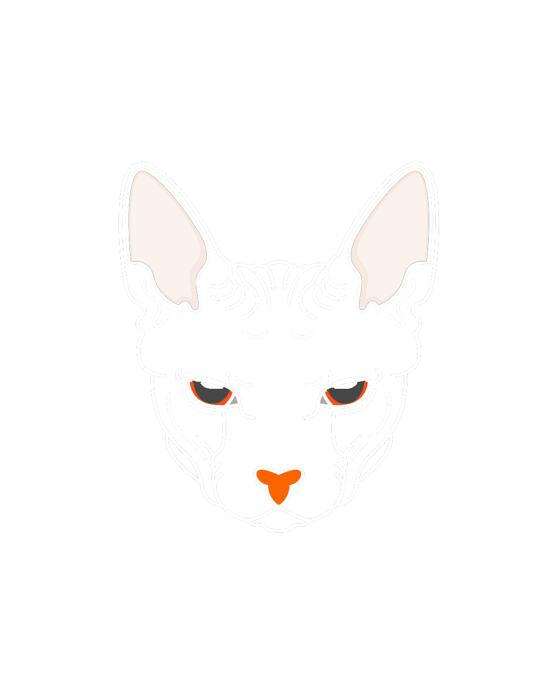

# Portfolio App



My iOS application that is written entirely in Swift and built using UiKit.

## Features

### Custom Images
I created custom icons and images for (almost) everything you see using a combination of:
- Adobe Photoshop
- Adobe Illustrator
- Sketch
- SF Symbols

### 2048
- A 2048 Clone.
- Adaptation of austinzhend's 2048
https://github.com/austinzheng/swift-2048.
- Added leaderboard functionality with persistent local data showing top 5 scores via CoreData.
- Modified GameBoard and Scenes to fit any device resolution

### Work Hour Tracker
- Keeps track of work hours.
- Data is stored/retrieved with CoreData.
- Date/Time picker in case of retroactive input.

### Prank Loading Screen
- Created as a joke for friends
- Initially the dramatically long loading screen was to be viewed when you first opened the app,
with an option to disable the process altogether in settings (which I did implement). But I later
decided to move it to an optional home-screen button that opens modally.

### Settings
- Toggle for Dark Mode/Light Mode
- Toggle to disable background particle animation (Improves performance on older devices with less powerful processors)

## Installation

1. Clone the repository:
   ```sh
   git clone https://github.com/Braedenp232/portfolio-ios-app.git
2. Open the project in Xcode.
3. Build and run the app on your iOS device or simulator.

## Screenshots

## Contributing

I welcome contributions from the community. If you'd like to contribute, follow these steps:

1. Fork the repository.
2. Create your feature branch (git checkout -b feature/XXXXXX).
3. Commit your changes (git commit -m 'Add some feature').
4. Push to the branch (git push origin feature/XXXXXX).
5. Open a pull request.

## Support

For any questions or issues, please open an issue on GitHub.

## License

This project is licensed under the MIT License - see the LICENSE file for details.

## About the Developer

This Portfolio App is developed and maintained by myself, Braeden. 
Feel free to reach out with any questions or feedback.

